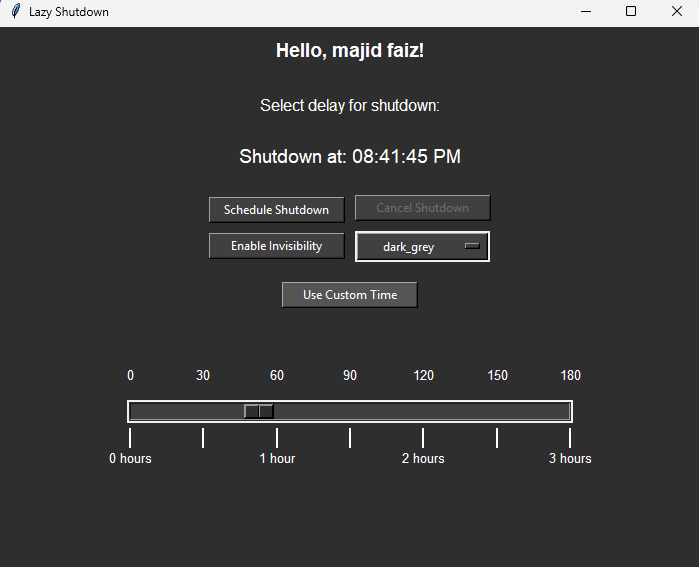

# Lazy Sleep - Smart Shutdown Timer

A customizable shutdown timer application with both slider and manual time input options.

App:

  

Icon:

## Why I Made This

I made this because I like being lazy. When I’m in bed with just my mouse (no keyboard in reach), I want a simple way to set a shutdown timer without faffing about. **Lazy Sleep** lets me do exactly that. Just move a slider, click a button, and forget about it.

If I’m still awake and change my mind? No problem – one click cancels it. And because I like things looking neat, there’s a dark mode and even an "invisibility mode" that hides the window when I move my mouse away. Effortless.

## Features

- Set shutdown timer with slider (up to 3 hours) or manual input (any duration)
- Visual countdown display
- Toggle between light and dark themes
- "Invisibility mode" that hides the window when the mouse moves away
- Cancel scheduled shutdowns
- Personalized greeting with your account name

## How to Use

1. **Select Time**:

   - Use the slider at the bottom (0-180 minutes)
   - OR click "Use Custom Time" to enter hours/minutes manually

2. **Schedule Shutdown**:

   - Click "Schedule Shutdown" to confirm
   - The display will show your shutdown time

3. **Cancel Shutdown**:

   - Click "Cancel Shutdown" if you change your mind

4. **Customise**:
   - Change themes via the dropdown menu
   - Enable "Invisibility" to auto-hide the window

## Requirements

- Windows 10/11
- Python 3.6+
